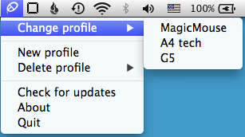

MouseMemory
============

OS X tool for fast switching between stored mouse sensitivity settings

Tested on Snow Leopard (10.6) and Maverics (10.9)

System sensitivity settings code used from Mouse Acceleration (https://bitbucket.org/boredzo/mouse-acceleration) by Peter Hosey
